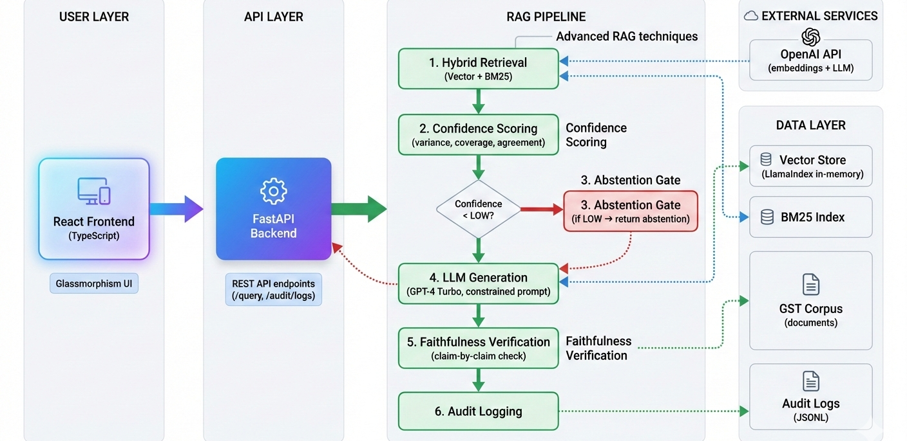

# GST Compliance RAG - Backend

A production-grade Retrieval-Augmented Generation system for Indian GST compliance queries, built with advanced RAG techniques and safety-first design.

## 🚀 Live Demo

**Check out the live application**: [https://invoice-compliance-frontend.vercel.app/](https://invoice-compliance-frontend.vercel.app/)

## Architecture



## What This Does

This system answers GST compliance questions by retrieving relevant information from official GST documentation and generating accurate, grounded responses. It's designed to never hallucinate - if it doesn't have enough information, it explicitly says so.

## Advanced RAG Techniques Used

### 1. **Hybrid Retrieval**
- Combines dense vector search (semantic) with BM25 (keyword-based)
- Ensures we catch both conceptual matches and exact terminology
- Deduplicates results intelligently

### 2. **Confidence Scoring**
- Multi-metric evaluation: score variance, term coverage, retriever agreement
- Explicit confidence levels (HIGH/MEDIUM/LOW)
- Prevents low-confidence answers from being shown

### 3. **Abstention Gate**
- System refuses to answer when evidence is weak
- Better to say "I don't know" than to guess
- Critical for regulatory/compliance use cases

### 4. **Faithfulness Verification**
- Post-generation claim verification
- Each statement is checked against source documents
- Answers rejected if any claim is unsupported

### 5. **Metadata-Rich Chunking**
- Every chunk tagged with clause_id and source
- Enables precise citation and traceability
- 512-token chunks with 50-token overlap for context preservation

## Tech Stack

- **Framework**: FastAPI
- **RAG Engine**: LlamaIndex (retrieval only, not black-box)
- **LLM**: OpenAI GPT-4 Turbo
- **Vector Store**: In-memory (LlamaIndex default)
- **Retrievers**: VectorIndexRetriever + BM25Retriever

## Setup

```bash
# Install dependencies
pip install -r requirements.txt

# Set your OpenAI API key

# Run the server
uvicorn app.main:app --host 0.0.0.0 --port 8000
```

## API Endpoints

### `POST /api/v1/query`
Main query endpoint. Returns either an answer with sources or an abstention with reason.

**Request:**
```json
{
  "question": "What is the penalty for late GST filing?",
  "jurisdiction": "DPDP"
}
```

**Response (Success):**
```json
{
  "query_id": "uuid",
  "answer": "...",
  "confidence": "HIGH",
  "grounding_nodes": [...],
  "faithfulness_score": 1.0,
  "outcome": "ANSWERED"
}
```

**Response (Abstention):**
```json
{
  "query_id": "uuid",
  "reason": "No relevant GST clauses found in the corpus.",
  "confidence": "LOW",
  "outcome": "ABSTAINED"
}
```

### `GET /api/v1/audit/logs`
Returns all query logs for compliance auditing.

## Deployment (Render)

1. Push this folder to a GitHub repo
2. Connect to Render
3. Set environment variable: `OPENAI_API_KEY`
4. Deploy as Web Service
5. Build command: `pip install -r requirements.txt`
6. Start command: `uvicorn app.main:app --host 0.0.0.0 --port $PORT`


## Why This Matters for Production

- **No Hallucinations**: Faithfulness verification + abstention gate
- **Auditable**: Every query logged with outcome and confidence
- **Explainable**: Every answer cites specific source clauses
- **Failure-Aware**: Treats "not knowing" as a first-class outcome
- **Deterministic**: Same query = same result (no randomness in retrieval)
